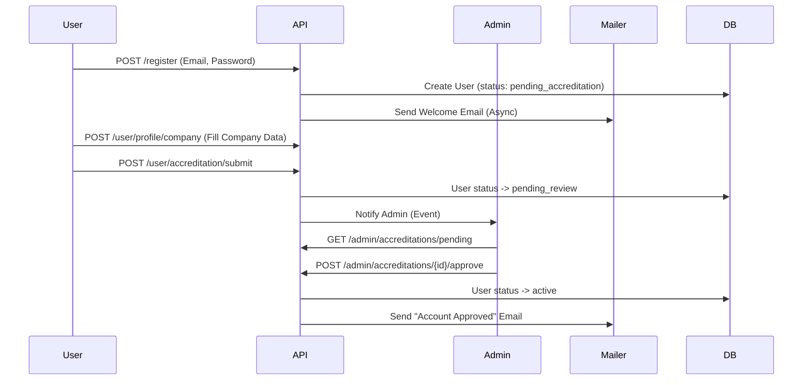

# Leader Grant Backend — Полная Техническая Документация

## 1. Введение

**Leader Grant Backend** — это высоконагруженная серверная платформа для автоматизации процессов выдачи финансовых продуктов (банковские гарантии, кредиты, факторинг) для бизнеса. Система выступает единым окном взаимодействия между тремя ключевыми участниками рынка:
1.  **Клиенты (Заемщики)**: Компании, которым нужны финансовые продукты.
2.  **Агенты (Партнеры)**: Посредники, которые приводят клиентов и получают комиссию.
3.  **Банки (Кредиторы)**: Финансовые организации, выдающие продукты.

Проект разработан с использованием **Symfony 7.3** и следует принципам **Modular Monolith** (Модульный Монолит), что обеспечивает высокую связность внутри модулей и слабую связанность между ними.

---

## 2. Архитектура Системы

### 2.1. Концептуальная Схема (C4 Context)

```mermaid
graph TD
    Client[Клиент / Компания] -->|Подает заявки, грузит доки| API
    Agent[Агент / Партнер] -->|Приводит клиентов, следит за статусами| API
    Bank[Сотрудник Банка] -->|Рассматривает заявки, выставляет оферты| API
    Admin[Администратор] -->|Модерация, Управление справочниками| API

    subgraph "Leader Grant Platform"
        API[Backend API (Symfony)]
        DB[(PostgreSQL / MySQL)]
        FS[File Storage (Flysystem)]
        MQ[Message Queue (RabbitMQ / Doctrine)]
        Mailer[Email Service]
    end

    API --> DB
    API --> FS
    API --> MQ
    MQ --> API
    API --> Mailer
```

### 2.2. Архитектурный Стиль: Modular Monolith

Приложение разделено на независимые вертикальные модули (Bounded Contexts), каждый из которых отвечает за свою предметную область. В отличие от микросервисов, они живут в одном репозитории и деплоятся вместе, но программно изолированы.

**Структура модулей (`src/`):**

| Модуль | Описание | Ключевые Сущности |
| :--- | :--- | :--- |
| **User** | Управление пользователями, аутентификация, профили компаний, аккредитация. | `User`, `Company`, `ClientAgentLink` |
| **Application** | Ядро системы. Заявки на продукты, жизненный цикл, калькулятор. | `Application`, `ProductType`, `StatusHistory` |
| **Document** | Документооборорот. Метаданные, типы, статусы, версионность. | `Document`, `DocumentType` |
| **Upload** | Технический модуль. Абстракция хранения файлов, валидация, Flysystem. | `UploadedFile`, `FileContext` |
| **Bank** | Справочник банков, условия, логотипы, настройки интеграций. | `Bank` |
| **Chat** | Система обмена сообщениями внутри заявки. | `Message` |
| **Admin** | Административная панель, сводная статистика, модерация. | - |
| **Notification** | (В планах) Центр уведомлений. | - |

### 2.3. Слоевая Архитектура (Layered Architecture)

Внутри каждого модуля соблюдается строгое разделение ответственности:

1.  **Presentation Layer (Controller / API)**
    *   Принимает HTTP-запросы (DTO).
    *   Валидирует входные данные.
    *   Вызывает Service Layer.
    *   Возвращает JSON-ответы (сериализация).
    *   *Пример: `ApplicationController::create()`*

2.  **Service Layer (Business Logic)**
    *   Содержит всю бизнес-логику.
    *   Оркестрирует вызовы репозиториев и других сервисов.
    *   Генерирует доменные события (Events).
    *   *Пример: `ApplicationService::createApplications()`*

3.  **Domain Layer (Entity & Enum)**
    *   Чистые PHP-классы, отражающие структуру БД.
    *   Содержат логику валидации состояния (например, `User::getRoles()`).
    *   *Пример: `Application`, `ApplicationStatus`*

4.  **Infrastructure Layer (Repository & External)**
    *   Работа с БД (Doctrine ORM).
    *   Отправка почты (Mailer).
    *   Работа с файловой системой (Flysystem).
    *   *Пример: `ApplicationRepository`, `UploadService`*

---

## 3. Детальный Анализ Модулей

### 3.1. Модуль User (Пользователи и Компании)

Этот модуль является фундаментом системы. Он управляет доступом и профилями.

**Ключевые Сервисы:**

*   **`RegistrationService`**:
    *   Регистрирует новых пользователей.
    *   Хеширует пароли (`UserPasswordHasherInterface`).
    *   Генерирует событие `UserRegisteredEvent` для отправки Welcome-письма.
    *   Устанавливает начальный статус `pending_accreditation`.

*   **`UserService`**:
    *   **Аккредитация**: Управляет процессом проверки пользователя админом (`submitForAccreditation`, `approveAccreditation`, `rejectAccreditation`).
    *   **Профиль**: Обновляет данные пользователя и компании (`updateProfile`, `updateCompanyProfile`).
    *   **Валидация**: Следит за уникальностью Email и ИНН.

*   **`AgentService`**:
    *   Специфичная логика для Агентов.
    *   **Связь с клиентами**: Метод `addClient` позволяет агенту зарегистрировать клиента (создать "теневого" пользователя) и привязать его к себе через `ClientAgentLink`.
    *   **Управление документами клиента**: Агент может загружать документы ЗА клиента (`uploadClientDocument`).

**События (Events):**
*   `UserRegisteredEvent`: Новый юзер -> Отправить Email.
*   `AccreditationSubmittedEvent`: Подана заявка на аккредитацию -> Уведомить админа.
*   `AccreditationApprovedEvent`: Аккредитация одобрена -> Открыть доступ.

### 3.2. Модуль Application (Заявки)

Центральный модуль бизнес-логики.

**Ключевые Сервисы:**

*   **`ApplicationService`**:
    *   **Создание (`createApplications`)**:
        *   Принимает `CreateApplicationDTO`.
        *   Создает заявки сразу в **несколько банков** (Batch creation).
        *   **Cross-Selling**: Если в DTO стоит флаг `need_credit`, автоматически дублирует заявку с типом `CREDIT`.
    *   **Список (`listForUser`)**:
        *   Сложная фильтрация по ролям (Клиент видит свои, Агент — своих клиентов, Партнер — только заявки в свой банк).
        *   Фильтры по датам, суммам, статусам.
    *   **Смена статуса (`updateStatus`)**:
        *   Проверяет права (только Админ или Партнер банка).
        *   Логирует изменение в `ApplicationStatusHistory`.
        *   Если статус `offer_received`, сохраняет ставку и комиссию.
        *   Генерирует `ApplicationStatusChangedEvent`.

**Сущности:**
*   `Application`: Сама заявка. Связана с `User` (клиент), `User` (агент), `Bank`.
*   `ProductType` (Enum): `bank_guarantee`, `credit`, `factoring`, `rko`.
*   `ApplicationStatus` (Enum): `draft`, `submitted`, `under_review`, `approved`, `rejected`...

### 3.3. Модуль Document & Upload (Файлы)

Здесь реализована интересная архитектура разделения метаданных и физических файлов.

**Архитектура Хранения:**
1.  **`UploadedFile` (Entity)**: Физический файл.
    *   Хранит путь (`storagePath`), имя (`storedFileName`), размер, MIME.
    *   Не знает о бизнес-сущностях (кто именно на него ссылается).
    *   Управляется сервисом `UploadService`.
2.  **`Document` (Entity)**: Логический документ.
    *   Имеет тип (`DocumentType`: Устав, Паспорт...).
    *   Имеет статус (`pending`, `approved`, `rejected`).
    *   Ссылается на `UploadedFile`.
    *   Привязывается к `Application` или `Company`.

**Ключевые Сервисы:**

*   **`UploadService`**:
    *   Обертка над **Flysystem**.
    *   Поддерживает **Public** (аватарки) и **Private** (документы) хранилища.
    *   Генерирует уникальные имена файлов (Slug + UUID).
    *   `uploadFile(...)`: Загружает файл.
    *   `replaceFile(...)`: Заменяет физический файл (Soft Delete старого).

*   **`DocumentService`**:
    *   `uploadFile(...)`: Создает `Document` + вызывает `UploadService`.
    *   `replaceDocument(...)`: Реализует **версионность**.
        *   Старый документ помечается `isArchived = true`.
        *   Создается новый документ, ссылающийся на старый через `parentDocument`.
    *   `approveDocument` / `rejectDocument`: Модерация документов.

### 3.4. Модуль Chat (Сообщения)

Система коммуникации внутри заявки.

**Особенности:**
*   **Премодерация**: Сообщения от Клиентов и Агентов попадают в статус `pending`. Они не видны Банку, пока Админ их не одобрит.
*   **Вложения**: Сообщения могут содержать ссылки на `Document`.

**Ключевые Сервисы:**
*   **`ChatService`**:
    *   `sendMessage`: Создает сообщение. Если роль не Admin/Partner -> статус `pending`.
    *   `getMessagesForApplication`: Возвращает переписку. Фильтрует `pending` сообщения для обычных юзеров.
    *   `approveMessage` / `rejectMessage`: Админские действия.

---

## 4. Бизнес-Процессы (Workflows)

### 4.1. Процесс Регистрации и Аккредитации


### 4.2. Подача Заявки (Application Flow)
1.  **Клиент/Агент** заполняет форму (`CreateApplicationDTO`).
2.  Выбирает **несколько банков** (массив `bank_ids`).
3.  **Backend** создает N заявок (по одной на банк).
4.  Если выбран чекбокс "Нужен кредит" (Cross-sell), создаются дубликаты заявок с типом `CREDIT`.
5.  Заявки получают статус `draft`.
6.  Пользователь загружает документы (`POST /documents`), привязывая их к заявкам.
7.  Пользователь отправляет заявку (`POST /applications/{id}/submit`). Статус -> `submitted`.

### 4.3. Обработка Заявки (Bank Flow)
1.  **Сотрудник Банка** (Partner) видит заявку в статусе `submitted`.
2.  Берет в работу -> статус `under_review`.
3.  Изучает документы. Может написать в Чат (вопрос клиенту).
4.  **Решение**:
    *   **Одобрение**: Ставит статус `offer_received`, указывает ставку (`tariff_rate`) и комиссию.
    *   **Отказ**: Ставит статус `rejected`, указывает причину.
    *   **Доработка**: Ставит статус `returned_for_revision`.

---

## 5. Технические Компоненты

### 5.1. Асинхронность (Symfony Messenger)
Используется для отправки писем и тяжелых задач, чтобы не замедлять ответ API.
*   **Transport**: `doctrine` (в базе данных) или `amqp` (RabbitMQ).
*   **Конфиг**: `config/packages/messenger.yaml`.
*   **Воркер**: Запускается командой `php bin/console messenger:consume async`.

### 5.2. Файловое Хранилище (Flysystem)
*   **Private Storage** (`var/storage`): Для документов. Доступ только через контроллер `DocumentController::download`, который проверяет права.
*   **Public Storage** (`public/uploads`): Для аватарок и логотипов банков. Раздается Nginx'ом напрямую как статика.

### 5.3. Безопасность (Security)
*   **JWT**: Используется `LexikJWTAuthenticationBundle`. Токены живут 1 час (refresh token - 1 месяц).
*   **Voters**: Для проверки прав доступа к конкретным объектам (например, `ApplicationVoter` проверяет, является ли юзер владельцем заявки).
*   **Roles**: Иерархия ролей (`ROLE_ADMIN` > `ROLE_AGENT` > `ROLE_USER`).

---

## 6. Развертывание и Запуск

### Требования
*   PHP 8.2+
*   Composer
*   PostgreSQL / MySQL
*   Symfony CLI

### Инструкция
1.  **Клонирование и установка**:
    ```bash
    git clone <repo>
    composer install
    ```
2.  **Настройка окружения**:
    Скопируйте `.env` в `.env.local` и настройте `DATABASE_URL`, `MAILER_DSN`.
3.  **База данных**:
    ```bash
    php bin/console doctrine:database:create
    php bin/console doctrine:migrations:migrate
    ```
4.  **JWT Ключи**:
    ```bash
    php bin/console lexik:jwt:generate-keypair
    ```
5.  **Запуск сервера**:
    ```bash
    symfony server:start
    ```
6.  **Запуск воркера (обязательно для почты)**:
    ```bash
    php bin/console messenger:consume async -vv
    ```

---

## 7. API Endpoints (Краткая справка)

Полная документация доступна в Swagger (если установлен NelmioApiDocBundle) или в Postman коллекции.

### Auth
*   `POST /api/login_check` — Получить токен
*   `POST /api/token/refresh` — Обновить токен

### User
*   `POST /api/register` — Регистрация
*   `GET /api/user/profile` — Получить профиль
*   `POST /api/user/profile` — Обновить профиль
*   `POST /api/user/profile/company` — Обновить компанию
*   `POST /api/user/accreditation/submit` — Подать на аккредитацию

### Applications
*   `POST /api/applications` — Создать заявку
*   `GET /api/applications` — Список (фильтры)
*   `GET /api/applications/{id}` — Детали
*   `PATCH /api/applications/{id}/status` — Сменить статус

### Documents
*   `POST /api/documents` — Загрузить документ
*   `GET /api/documents/{id}/download` — Скачать
*   `DELETE /api/documents/{id}` — Удалить

### Chat
*   `GET /api/applications/{id}/messages` — История
*   `POST /api/applications/{id}/messages` — Написать

---

*Документация актуальна для версии API v1.0 от 25.11.2025.*
